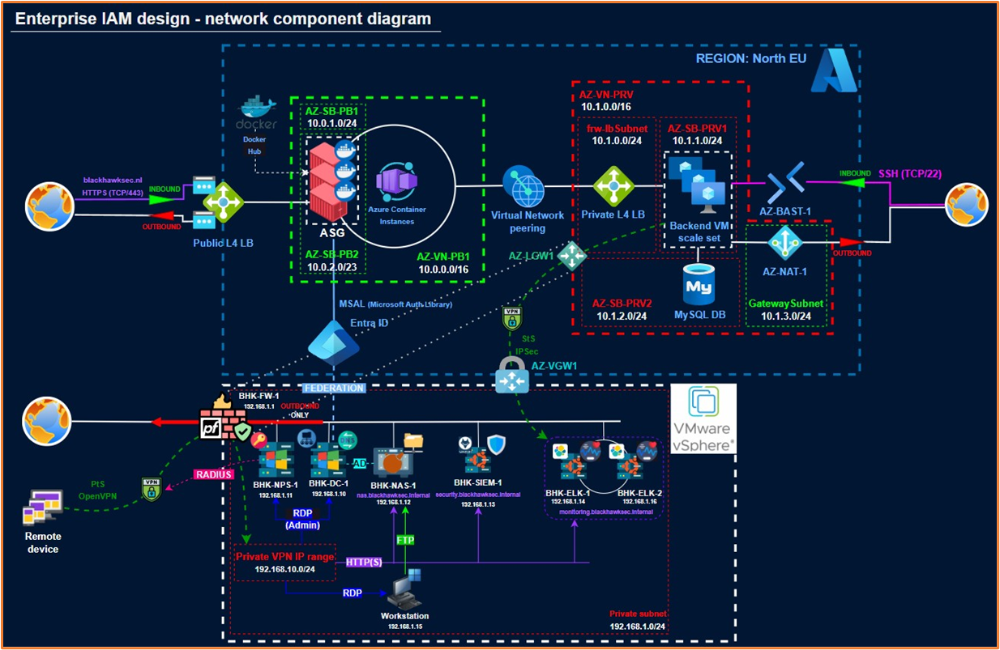

## Project Overview

This is the GitHub repository for the "Enterprise IAM solutions" software project. The project is a secure web application built in TypeScript, with React and Nest. The application features integration with the on-premise network setup, constructed in a vSphere NetLab environment.

## Application Details

- **Deployment Environment**: Microsoft Azure
- **Key Features**:
  - Secure web application
  - Integration with on-premise network
  - Built in TypeScript, React, and Nest
  - Constructed in vSphere NetLab environment
  - Certificate management and validation handled by cloud environment

## Security Considerations

- The application is deployed on Microsoft Azure, designed with security, performance, and cost optimization in mind.
- The cloud environment utilizes an optimal combination of resources to achieve desired functionality.
- The on-premise network features live threat monitoring, advanced ELK, Kibana, and Logstash monitoring dashboard that securely integrates with the cloud environment.

## Assessment Results

Penetration testing of the previously hosted application at https://blackhawksec.nl/ concluded with:

- No vulnerabilities found
- Overall assessment meets industry standards

## Additional Information

- Diagram related to the cloud deployment:

- The repository contains information about the cloud environment setup, including security measures and resource allocation.
___

### Student credentials

| Student name       | Student number     |
|--------------------|--------------------|
| Atanasov Dimitar   | **4740335**        | 
| Balan Mihai        | **4748425**        |
| Constantin Mario   | **4721063**        |   
| Digrys Augustinas  | **4852311**        | 
| Dragomir Ionut     | **4877675**        | 
| Ivan Alexandru     | **4804813**        | 
___


### Run backend on localhost (dev):
  API endpoints: http://localhost:{be-port}/api/v1  
```
  cd iam-enterprise-architecture-backend
  npm install
  npm run start:dev
```

### Run frontend on localhost:
API endpoints (make sure that backend is running): http://localhost:{fe-port}/api/v1  
Client: http://localhost:{fe-port}/login
```
  cd iam-enterprise-architecture-frontend
  npm install
  npm run dev
```

To run a development build, please contact a repository member regarding environment variables.
